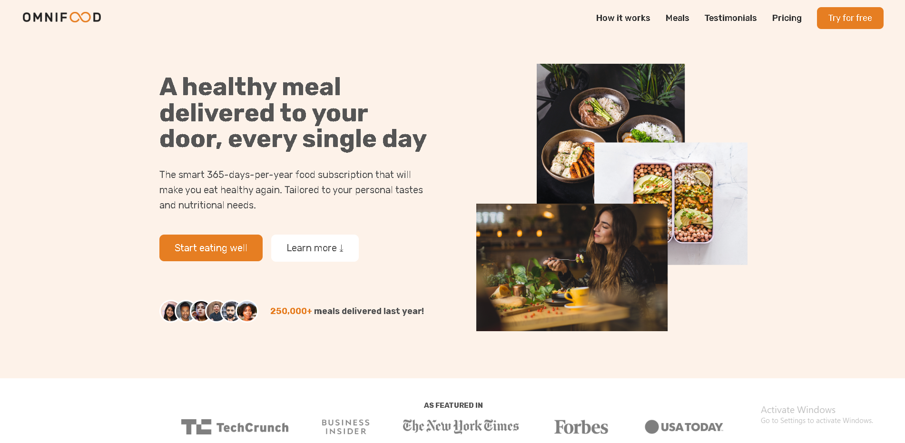

# 🍽️ Omnifood

A modern and responsive landing page for a fictional food delivery service.

## ✨ Features

- 📱 Fully responsive design
- 🎨 Modern and clean UI
- ✨ Smooth scrolling navigation
- 📌 Sticky navigation
- 🎭 CSS animations
- 🚀 Optimized layout and typography

## 🛠️ Built With

- HTML5
- CSS3
- JavaScript (ES6)

## 📸 Screenshot



## 🚀 Live Demo

Coming soon...

## 📂 Project Structure

```
Omnifood/
│── index.html
│── css/
│── js/
│── img/
│── screenshot.png
└── README.md
```

## 📚 What I Learned

- Semantic HTML
- Advanced CSS
- Flexbox
- CSS Grid
- Responsive Web Design
- JavaScript DOM Manipulation
- Smooth Scrolling
- Sticky Navigation

## 👨‍💻 Author

Created by Kian.
